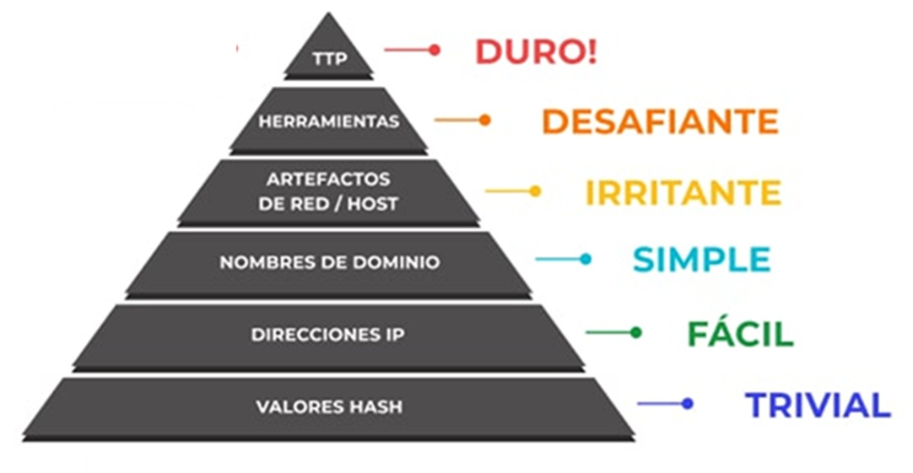
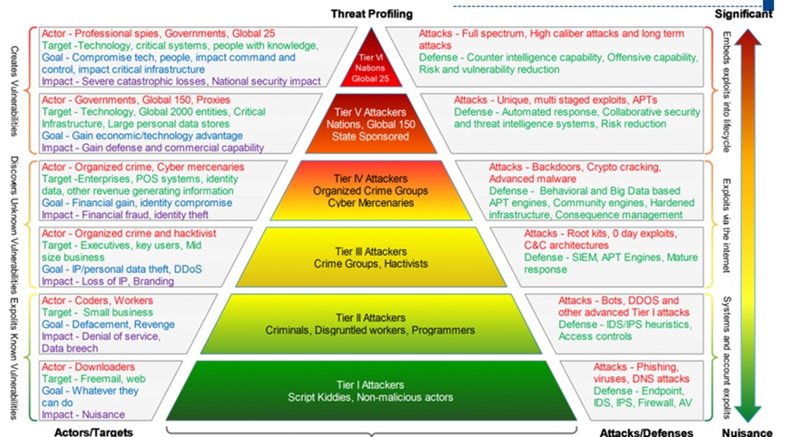

# DIPLOMADO CIBERSEGURIDAD Y CIBERDEFENSA 2025 - 1

---
# **Piramide del Dolor**

La Pirámide del Dolor en ciberseguridad es un modelo conceptual creado por David J. Bianco que clasifica diferentes tipos de indicadores de compromiso (IOCs, Indicators of Compromise) según el nivel de dificultad (o "dolor") que supone para un atacante si un defensor los detecta y actúa sobre ellos.

El objetivo de esta pirámide es ayudar a los analistas de seguridad a centrarse en los indicadores que realmente afectan las capacidades del atacante, no solo en los más fáciles de identificar.

**Actividad**
Identifique sobre cada uno de los niveles estrategías de detección y/o contensión. 

Recurso
- (https://excalidraw.com/#room=9e41b550e81dd539fdbe,wRoW9o2wOQJZhDy5R79xYA)

---

# **Perfilado de amenazas**

El perfilado de amenazas (Threat Profiling) en ciberseguridad, clasifica a los atacantes según su sofisticación, recursos, objetivos y el impacto potencial de sus ataques. La pirámide va desde los actores menos sofisticados y de menor impacto (en la base) hasta los más avanzados y peligrosos (en la cima).

---

##  HACKING  ETICO

El **hacking ético** es la práctica de utilizar las mismas técnicas y herramientas que los hackers maliciosos (también conocidos como "crackers" o "black hat hackers"), pero con **propósitos legítimos y autorizados**, para identificar y corregir vulnerabilidades en sistemas informáticos, redes y aplicaciones. Su objetivo principal es mejorar la seguridad de una organización antes de que un atacante malintencionado pueda explotar esas debilidades.

En esencia, un hacker ético (o "hacker de sombrero blanco") actúa como un atacante simulado, buscando activamente fallos de seguridad para:

* **Identificar vulnerabilidades:** Descubrir puntos débiles en el sistema que podrían ser explotados.
* **Evaluar la postura de seguridad:** Determinar qué tan robusta es la defensa de una organización.
* **Proponer soluciones:** Recomendar medidas para corregir las vulnerabilidades encontradas.
* **Prevenir ataques reales:** Fortalecer las defensas para evitar incidentes de seguridad en el futuro.

Todo esto se realiza con el **consentimiento explícito** del propietario del sistema o red, y bajo un estricto código de ética y legalidad.

### Tipos de Hacking Ético (Clasificación de Hackers)

La clasificación más común de los hackers se basa en sus intenciones y la legalidad de sus acciones:

1.  **Hackers de Sombrero Blanco (White Hat Hackers):**
    * Son los hackers éticos por excelencia.
    * Trabajan de forma legal y autorizada, generalmente contratados por empresas o gobiernos.
    * Su objetivo es proteger sistemas, identificar vulnerabilidades y fortalecer la ciberseguridad.
    * Siempre informan de sus hallazgos para que se puedan aplicar soluciones.

2.  **Hackers de Sombrero Negro (Black Hat Hackers o Crackers):**
    * Son los ciberdelincuentes.
    * Utilizan sus habilidades para fines maliciosos e ilegales, como robo de datos, fraude, extorsión, interrupción de servicios, daño a sistemas, etc.
    * Actúan sin autorización y con la intención de causar daño o beneficio personal ilícito.

3.  **Hackers de Sombrero Gris (Grey Hat Hackers):**
    * Operan en una zona intermedia entre los blancos y los negros.
    * Pueden descubrir vulnerabilidades sin la autorización previa del propietario del sistema.
    * Aunque sus intenciones no suelen ser maliciosas (a menudo buscan informar sobre la vulnerabilidad para que sea corregida), sus métodos pueden ser ilegales si no tienen permiso.
    * Pueden hacer públicos los hallazgos si no obtienen una respuesta de la organización.

### Tipos de Actividades de Hacking Ético (Técnicas Comunes)

Dentro del ámbito del hacking ético, se realizan diversas actividades y técnicas para evaluar la seguridad:

* **Pruebas de Penetración (Penetration Testing o Pentesting):** Consiste en simular un ataque real a un sistema, red o aplicación para encontrar y explotar vulnerabilidades, evaluando la resistencia de las defensas. Puede ser:
    * **Externo:** Simula un ataque desde fuera de la red de la organización (internet).
    * **Interno:** Simula un ataque desde dentro de la red, como si un empleado o alguien con acceso físico intentara explotar vulnerabilidades.
* **Análisis de Vulnerabilidades:** Un proceso más amplio que las pruebas de penetración, enfocado en identificar y clasificar las vulnerabilidades existentes en un sistema, red o aplicación, sin necesariamente explotarlas. Se utilizan herramientas automatizadas y manuales.
* **Análisis de Código Fuente:** Revisar el código de una aplicación o software en busca de errores de programación que puedan llevar a vulnerabilidades de seguridad.
* **Ingeniería Social:** Evaluar la vulnerabilidad de los empleados de una organización a tácticas de engaño (como phishing, vishing o pretexting) que buscan obtener información confidencial o acceso a sistemas.
* **Auditoría de Seguridad:** Una revisión sistemática y exhaustiva de los sistemas, procesos y políticas de seguridad para asegurar que cumplen con las normativas y mejores prácticas.
* **Análisis Forense Digital:** En caso de un incidente de seguridad (un ataque real), un hacker ético con conocimientos forenses puede investigar cómo ocurrió el ataque, qué datos fueron comprometidos y cómo prevenir futuros incidentes.
* **Red Teaming (Equipo Rojo):** Un equipo de hackers éticos que simulan ser adversarios reales, utilizando todas las técnicas posibles para intentar infiltrarse en la organización.
* **Blue Teaming (Equipo Azul):** El equipo defensor de la organización que trabaja para detectar, prevenir y responder a los ataques simulados del Red Team, y en general, a cualquier amenaza cibernética.
* **Purple Teaming (Equipo Púrpura):** Un enfoque colaborativo donde los equipos Rojo y Azul trabajan juntos para mejorar las defensas, compartiendo conocimientos y estrategias.

El hacking ético es una disciplina crucial en el mundo actual, ayudando a las organizaciones a mantenerse un paso adelante de los ciberdelincuentes y a proteger su información y sus operaciones.

