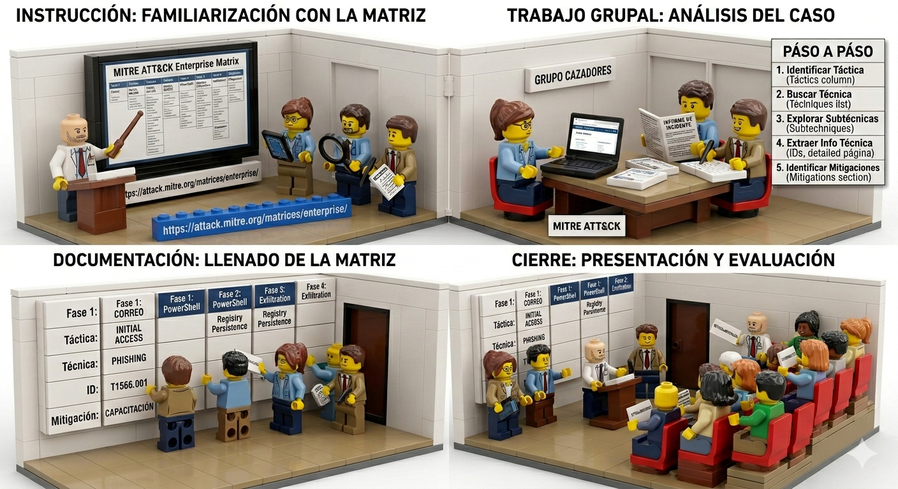

## Taller Práctico: "Cazadores de Amenazas: Descifrando el Tablero de MITRE ATT&CK"

### 1. Objetivos del Taller

* **Comprender** la estructura fundamental de la matriz MITRE ATT&CK Enterprise (Tácticas, Técnicas, Subtécnicas y Procedimientos).
* **Aprender** a navegar de forma fluida por la plataforma oficial ([https://attack.mitre.org/matrices/enterprise/](https://attack.mitre.org/matrices/enterprise/)).
* **Desarrollar** habilidades básicas de análisis para asociar comportamientos maliciosos reales con la documentación de la matriz.

### 2. Dinámica y Organización Grupal

* **Modalidad:** Grupal (Equipos de 3 a 4 integrantes).
* **Roles recomendados dentro del grupo:**
1. *Navegador:* Encargado de manipular la web de MITRE ATT&CK y proyectar o guiar la búsqueda.
2. *Analista Técnico:* Encargado de interpretar las pistas del caso de estudio.
3. *Redactor/Relator:* Encargado de documentar los hallazgos en la plantilla y exponer las conclusiones al final.

---

## 3. Estructura y Paso a Paso del Taller (Guía para el Estudiante)

### Fase 1: Familiarización con el Entorno (15 minutos)

Antes de resolver el caso, el grupo debe ingresar a [https://attack.mitre.org/matrices/enterprise/](https://attack.mitre.org/matrices/enterprise/) y localizar los tres componentes clave en la interfaz web:

1. **Las Columnas (Tácticas):** Representan el "por qué" u objetivo del atacante (ej. *Initial Access*, *Execution*, *Exfiltration*).
2. **Las Filas (Técnicas):** Representan el "cómo" el atacante logra ese objetivo (ej. *Phishing* bajo la columna de *Initial Access*).
3. **Las Subtécnicas:** Se despliegan haciendo clic en el botón gris lateral de algunas técnicas, mostrando variantes específicas de un ataque.

### Fase 2: Caso de Estudio - "El Incidente de la Factura Falsa" (45 minutos)

Cada grupo recibirá el siguiente escenario de un incidente de seguridad simulado:

> **Escenario:** Un empleado del área financiera recibió un correo electrónico sospechoso con el asunto "Factura Pendiente - Pago Urgente". El empleado descargó un archivo adjunto llamado `factura.pdf.exe`. Al ejecutarlo, no ocurrió nada visible en la pantalla, pero el malware utilizó la herramienta legítima de Windows **PowerShell** para descargar un script desde un servidor remoto. Posteriormente, el malware modificó el **Registro de Windows** para asegurar que el código malicioso se ejecutara automáticamente cada vez que el computador se encendiera. Finalmente, el atacante logró comprimir varios documentos confidenciales en un archivo `.zip` y los envió fuera de la red de la empresa a través de un canal web estándar (puerto 443 HTTPS).

#### Tareas del Grupo:

Los equipos deberán rellenar la siguiente **Matriz de Hallazgos**, identificando el ID de la técnica, el nombre oficial en inglés dentro de la plataforma y las mitigaciones sugeridas por MITRE.

| Fase del Incidente | Táctica de MITRE | Nombre de la Técnica / Subtécnica | ID de MITRE (ej. TXXXX) | ¿Qué mitigación sugiere MITRE? |
| --- | --- | --- | --- | --- |
| 1. Recepción del correo |  |  |  |  |
| 2. Uso de PowerShell |  |  |  |  |
| 3. Persistencia en el Registro |  |  |  |  |
| 4. Envío de datos por HTTPS |  |  |  |  |

---

## 4. Paso a Paso Ejemplificado (Resolución del Punto 1 del Caso)

Para garantizar la comprensión del taller, se describe a continuación cómo el grupo debe resolver el primer hito del escenario ("Recepción del correo malicioso"):

* **Paso 1: Identificar el objetivo (Táctica).** El grupo analiza que el correo es el método que usa el atacante para entrar en la organización. Al revisar las columnas superiores de la matriz Enterprise, identifican que la táctica adecuada es **Initial Access** (Acceso Inicial).
* **Paso 2: Buscar la técnica.** Los estudiantes dirigen la mirada hacia abajo en la columna *Initial Access* y localizan la técnica llamada **Phishing** (T1566).
* **Paso 3: Explorar subtécnicas.** Al notar que el caso habla específicamente de un archivo adjunto (`factura.pdf.exe`), hacen clic en el menú desplegable de la técnica *Phishing* para ver las subtécnicas. Identifican la opción **Spearphishing Attachment** (T1566.001).
* **Paso 4: Extraer la información técnica.** Hacen clic directamente sobre el nombre "Spearphishing Attachment". La página se actualizará mostrando la ficha técnica detallada. En el panel lateral derecho podrán observar el **ID: T1566.001**.
* **Paso 5: Identificar Mitigaciones.** Los estudiantes descienden en la página hasta la sección titulada **Mitigations**. Allí identificarán recomendaciones como *Antivirus/Antimalware*, *User Training* (Capacitación a usuarios) o *Restrict File Execution*. Anotan al menos una de ellas en su tabla.

---

## 5. Fase de Cierre y Evaluación. 

### Presentación de Resultados.

Un representante de cada grupo expondrá brevemente (3 minutos) una de las fases del incidente analizadas, explicando cómo llegaron a la técnica en la web de MITRE y qué recomendación le darían a la empresa para evitar ese ataque en el futuro.

### Solucionario para el Instructor (Para validar las respuestas del taller):

* **Hito 1 (Correo):** Táctica: *Initial Access* | Técnica: *Phishing: Spearphishing Attachment* (ID: T1566.001).
* **Hito 2 (PowerShell):** Táctica: *Execution* | Técnica: *Command and Scripting Interpreter: PowerShell* (ID: T1059.001).
* **Hito 3 (Registro):** Táctica: *Persistence* | Técnica: *Boot or Logon Autostart Execution: Registry Run Keys / Startup Folder* (ID: T1547.001).
* **Hito 4 (Envío HTTPS):** Táctica: *Exfiltration* o *Command and Control* | Técnica: *Exfiltration Over Web Service* (ID: T1567) o *Application Layer Protocol: Web Protocols* (ID: T1071.001). *(Ambas aproximaciones son válidas para el nivel básico y fomentan el debate técnico).*

### Criterios de Evaluación Básicos:

* Asociación correcta entre el texto del escenario y las tácticas de la matriz.
* Uso preciso de los identificadores de MITRE (IDs con formato TXXXX).
* Participación activa y distribución equitativa del trabajo dentro del equipo.